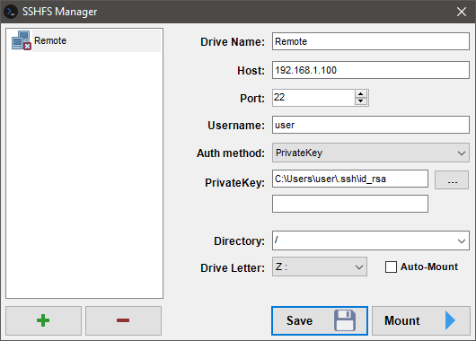

SSHFS Manager
=========

Intended for use with older machines (running XP or higher) that do not support SMB2+

**NOTE: Windows 10 is not supported, they can use encrypted SMB3 connections ;)**

Easily create a mapped network drive pointing to your SFTP shares:

In order to serve up the SFTP connection in the first place, I recommend running OpenSSH from the PowerShell team on your server:
https://github.com/PowerShell/Win32-OpenSSH/releases
